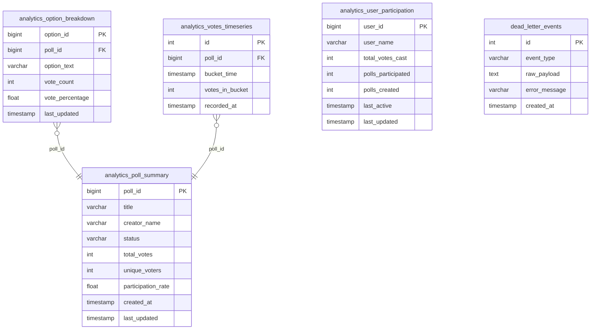

# Analytics Tables ERD

Pre-aggregated tables populated by the data-engineering pipeline for dashboard queries.

```mermaid
erDiagram
    analytics_poll_summary {
        bigint poll_id PK
        varchar title
        varchar creator_name
        varchar status
        int total_votes
        int unique_voters
        float participation_rate
        timestamp created_at
        timestamp last_updated
    }

    analytics_option_breakdown {
        bigint option_id PK
        bigint poll_id FK
        varchar option_text
        int vote_count
        float vote_percentage
        timestamp last_updated
    }

    analytics_votes_timeseries {
        int id PK
        bigint poll_id FK
        timestamp bucket_time
        int votes_in_bucket
        timestamp recorded_at
    }

    analytics_user_participation {
        bigint user_id PK
        varchar user_name
        int total_votes_cast
        int polls_participated
        int polls_created
        timestamp last_active
        timestamp last_updated
    }

    dead_letter_events {
        int id PK
        varchar event_type
        text raw_payload
        varchar error_message
        timestamp created_at
    }

    analytics_option_breakdown }o--|| analytics_poll_summary : "poll_id"
    analytics_votes_timeseries }o--|| analytics_poll_summary : "poll_id"
```
