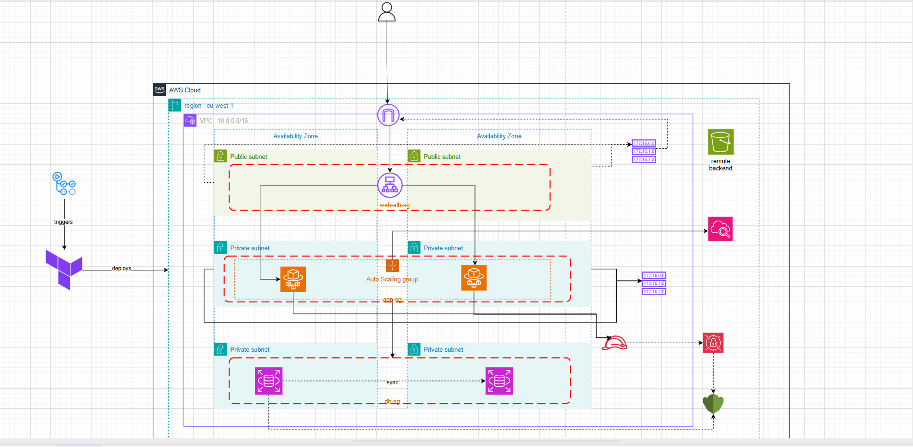

# QuickPoll - DevOps & Infrastructure

This directory contains all infrastructure-as-code, deployment scripts, and DevOps configurations for the QuickPoll platform.

## Infrastructure Overview



## Architecture Components

### AWS Services

**Compute**
- **ECS Fargate**: Serverless container orchestration
  - Backend service (Spring Boot)
  - Frontend service (Angular/Nginx)
  - Data engineering task (Python ETL)
- **Application Load Balancer**: HTTP/HTTPS traffic distribution
- **Auto Scaling**: Dynamic scaling based on CPU utilization

**Database**
- **RDS PostgreSQL 16**: Managed relational database
  - Instance: db.t3.micro
  - Storage: 20GB (auto-scaling to 50GB)
  - Backup retention: 3 days
  - Multi-AZ: Disabled (staging)

**Networking**
- **VPC**: Isolated network (10.0.0.0/16)
- **Public Subnets**: ALB placement (2 AZs)
- **Private App Subnets**: ECS tasks (2 AZs)
- **Private DB Subnets**: RDS instances (2 AZs)
- **NAT Gateway**: Outbound internet for private subnets
- **Internet Gateway**: Public internet access

**Container Registry**
- **ECR**: Docker image storage
  - quickpoll/backend
  - quickpoll/frontend
  - quickpoll/data-engineering

**Monitoring & Logging**
- **CloudWatch Logs**: Centralized logging
- **Container Insights**: ECS metrics
- **ALB Access Logs**: Request tracking

**Security**
- **Security Groups**: Network-level firewall
  - ALB SG: Allow 80/443 from internet
  - App SG: Allow traffic from ALB only
  - DB SG: Allow 5432 from App SG only
- **IAM Roles**: Task execution and application permissions

## Directory Structure

```
devops/
├── terraform/
│   ├── modules/           # Reusable Terraform modules
│   │   ├── alb/          # Application Load Balancer
│   │   ├── ecr/          # Elastic Container Registry
│   │   ├── ecs/          # ECS Fargate services
│   │   ├── ecs-task/     # One-shot ECS tasks
│   │   ├── rds/          # RDS PostgreSQL
│   │   ├── security-groups/  # Network security
│   │   └── vpc/          # Virtual Private Cloud
│   └── environments/      # Environment-specific configs
│       ├── staging/      # Staging environment
│       └── production/   # Production environment (future)
└── scripts/
    └── deploy.sh         # Local deployment helper
```

## Terraform Modules

### VPC Module
Creates isolated network infrastructure with public and private subnets across multiple availability zones.

**Resources:**
- VPC with DNS support
- Internet Gateway
- NAT Gateway (single for staging, multi-AZ for production)
- Route tables and associations
- Subnets (public, private-app, private-db)

### Security Groups Module
Defines network access rules following least-privilege principle.

**Security Groups:**
- `web-alb-sg`: Internet → ALB (80, 443)
- `app-sg`: ALB → ECS tasks (8080, 80)
- `db-sg`: ECS tasks → RDS (5432)

### ALB Module
Application Load Balancer with target groups and routing rules.

**Features:**
- HTTP listener on port 80
- Path-based routing (/api/* → backend, /* → frontend)
- Health checks with configurable thresholds
- Cross-zone load balancing

### ECS Module
Fargate-based container orchestration with auto-scaling.

**Services:**
- Backend: 512 CPU, 1024 MB memory
- Frontend: 256 CPU, 512 MB memory
- Auto-scaling: 1-3 tasks based on CPU

### RDS Module
Managed PostgreSQL database with automated backups.

**Configuration:**
- Engine: PostgreSQL 16
- Instance: db.t3.micro
- Storage: 20GB (auto-scaling enabled)
- Backups: 3-day retention
- Encryption: At rest and in transit

### ECR Module
Private Docker image repositories with lifecycle policies.

**Repositories:**
- quickpoll/backend
- quickpoll/frontend
- quickpoll/data-engineering

## Deployment

### Prerequisites

1. **AWS Account Setup**
   ```bash
   # Configure AWS CLI
   aws configure
   ```

2. **Terraform State Backend**
   ```bash
   # Create S3 bucket for state
   aws s3 mb s3://quick-poll-terraform-state --region eu-west-1
   
   # Create DynamoDB table for locking
   aws dynamodb create-table \
     --table-name quickpoll-terraform-locks \
     --attribute-definitions AttributeName=LockID,AttributeType=S \
     --key-schema AttributeName=LockID,KeyType=HASH \
     --billing-mode PAY_PER_REQUEST \
     --region eu-west-1
   ```

3. **GitHub Secrets**
   Configure in repository settings:
   - `AWS_ACCOUNT_ID`
   - `TF_VAR_DB_USERNAME`
   - `TF_VAR_DB_PASSWORD`
   - `TF_VAR_JWT_SECRET`

### Manual Deployment

```bash
# Navigate to environment
cd devops/terraform/environments/staging

# Set sensitive variables
export TF_VAR_db_username="quickpoll"
export TF_VAR_db_password="<strong-password>"
export TF_VAR_jwt_secret="<min-32-char-secret>"

# Initialize Terraform
terraform init

# Review changes
terraform plan

# Apply infrastructure
terraform apply

# Get outputs
terraform output
```

### CI/CD Deployment

Push to `develop` branch triggers automatic deployment:

1. **Terraform Apply**: Provisions/updates infrastructure
2. **Build Images**: Builds Docker images for all services
3. **Push to ECR**: Uploads images to container registry
4. **Deploy to ECS**: Updates services with new images
5. **Health Checks**: Waits for services to stabilize

## Configuration

### Staging Environment

**File:** `terraform/environments/staging/terraform.tfvars`

```hcl
aws_region = "eu-west-1"
db_name    = "quickpoll"
```

**Sensitive Variables** (via environment or GitHub Secrets):
- `TF_VAR_db_username`
- `TF_VAR_db_password`
- `TF_VAR_jwt_secret`

### Network Configuration

```
VPC CIDR: 10.0.0.0/16

Public Subnets:
  - 10.0.1.0/24 (eu-west-1a)
  - 10.0.2.0/24 (eu-west-1b)

Private App Subnets:
  - 10.0.10.0/24 (eu-west-1a)
  - 10.0.11.0/24 (eu-west-1b)

Private DB Subnets:
  - 10.0.20.0/24 (eu-west-1a)
  - 10.0.21.0/24 (eu-west-1b)
```

## Monitoring

### CloudWatch Logs

```bash
# Backend logs
aws logs tail /ecs/quickpoll/staging/backend --follow

# Frontend logs
aws logs tail /ecs/quickpoll/staging/frontend --follow

# Data engineering logs
aws logs tail /ecs/quickpoll/staging/data-engineering --follow
```

### Metrics

```bash
# ECS service metrics
aws cloudwatch get-metric-statistics \
  --namespace AWS/ECS \
  --metric-name CPUUtilization \
  --dimensions Name=ServiceName,Value=quickpoll-staging-backend \
  --start-time 2024-01-01T00:00:00Z \
  --end-time 2024-01-01T23:59:59Z \
  --period 3600 \
  --statistics Average

# RDS metrics
aws cloudwatch get-metric-statistics \
  --namespace AWS/RDS \
  --metric-name DatabaseConnections \
  --dimensions Name=DBInstanceIdentifier,Value=quickpoll-staging-postgres \
  --start-time 2024-01-01T00:00:00Z \
  --end-time 2024-01-01T23:59:59Z \
  --period 3600 \
  --statistics Average
```

## Troubleshooting

### ECS Task Failures

```bash
# List tasks
aws ecs list-tasks --cluster quickpoll-staging-cluster

# Describe task
aws ecs describe-tasks \
  --cluster quickpoll-staging-cluster \
  --tasks <task-arn>

# Check stopped tasks
aws ecs list-tasks \
  --cluster quickpoll-staging-cluster \
  --desired-status STOPPED
```

### Database Connection Issues

```bash
# Test RDS connectivity from ECS task
aws ecs execute-command \
  --cluster quickpoll-staging-cluster \
  --task <task-id> \
  --container backend \
  --interactive \
  --command "/bin/sh"

# Inside container
nc -zv <rds-endpoint> 5432
```

### Load Balancer Issues

```bash
# Check target health
aws elbv2 describe-target-health \
  --target-group-arn <target-group-arn>

# View ALB logs
aws s3 ls s3://quickpoll-staging-alb-logs/
```

## Security Best Practices

1. **Network Isolation**
   - ECS tasks in private subnets
   - RDS in isolated DB subnets
   - No direct internet access to backend services

2. **Least Privilege IAM**
   - Task execution role: ECR pull, CloudWatch logs
   - Task role: Application-specific permissions only

3. **Secrets Management**
   - Database credentials via environment variables
   - JWT secrets via GitHub Secrets
   - No hardcoded credentials in code

4. **Container Security**
   - Non-root users in Docker images
   - Minimal base images (Alpine)
   - Regular vulnerability scanning with Trivy

5. **Network Security**
   - Security groups with minimal required access
   - No SSH access to containers
   - HTTPS ready (certificate required)

## Cost Optimization

**Staging Environment:**
- Single NAT Gateway: ~$32/month
- ECS Fargate: ~$30/month (2 services, 1 task each)
- RDS db.t3.micro: ~$15/month
- ALB: ~$20/month
- Data transfer: ~$10/month

**Total: ~$107/month**

**Cost Reduction Tips:**
- Use Fargate Spot for non-critical workloads
- Enable RDS auto-pause for dev environments
- Use S3 for static assets instead of ECS
- Implement auto-scaling to scale down during off-hours

## Disaster Recovery

### Backup Strategy

**RDS Automated Backups:**
- Daily snapshots
- 3-day retention
- Point-in-time recovery

**Manual Backups:**
```bash
# Create RDS snapshot
aws rds create-db-snapshot \
  --db-instance-identifier quickpoll-staging-postgres \
  --db-snapshot-identifier quickpoll-manual-$(date +%Y%m%d)
```

### Recovery Procedures

**Database Restore:**
```bash
# Restore from snapshot
aws rds restore-db-instance-from-db-snapshot \
  --db-instance-identifier quickpoll-staging-postgres-restored \
  --db-snapshot-identifier <snapshot-id>
```

**Infrastructure Rebuild:**
```bash
# Destroy and recreate
terraform destroy
terraform apply
```

## Maintenance

### Updating Infrastructure

```bash
# Update Terraform modules
cd devops/terraform/environments/staging
terraform plan
terraform apply
```

### Scaling Services

```bash
# Manual scaling
aws ecs update-service \
  --cluster quickpoll-staging-cluster \
  --service quickpoll-staging-backend \
  --desired-count 3
```

### Database Maintenance

```bash
# Apply pending maintenance
aws rds apply-pending-maintenance-action \
  --resource-identifier <db-instance-arn> \
  --apply-action system-update \
  --opt-in-type immediate
```

## References

- [AWS ECS Best Practices](https://docs.aws.amazon.com/AmazonECS/latest/bestpracticesguide/)
- [Terraform AWS Provider](https://registry.terraform.io/providers/hashicorp/aws/latest/docs)
- [AWS Well-Architected Framework](https://aws.amazon.com/architecture/well-architected/)

---

**Maintained by:** [@nabbi007](https://github.com/nabbi007)
